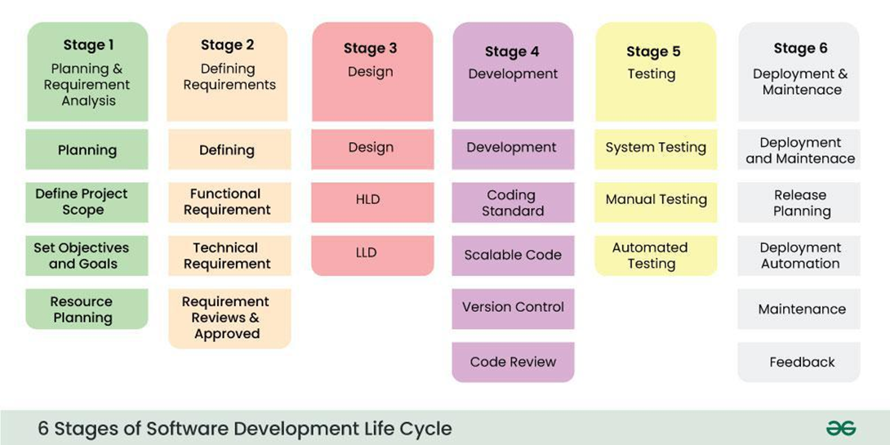
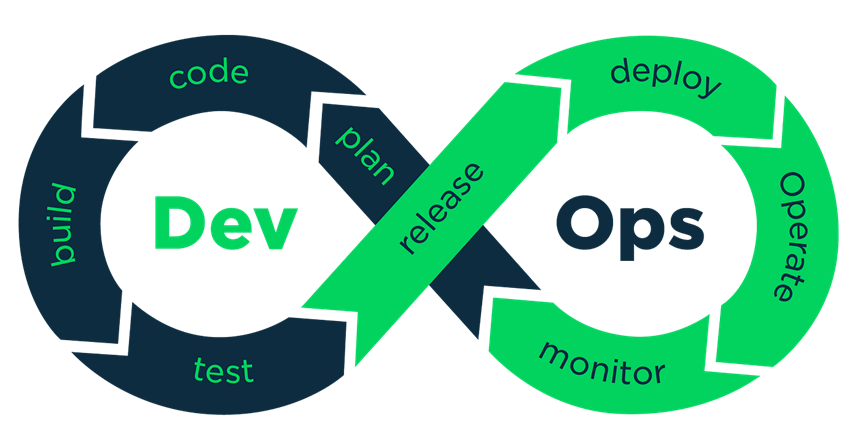

# **Introduction**

### **SDLC (Software Development Life Cycle)**

It is a methodology that defines the entire procedure of software development step-by-step. The goal of the SDLC life cycle model is to deliver high-quality, maintainable software that meets the user’s requirements.

### **Stages in SDLC**

### **SDLC Models**

**1\. Waterfall Model**

Best for Small, well-defined projects with clear requirements.

**Phases:**

Requirement Gathering → Design → Implementation → Testing → Deployment → Maintenance

| **Pros**                  | **Cons**                                      |
| ------------------------- | --------------------------------------------- |
| Simple and easy to manage | Rigid, no flexibility to accommodate changes. |
| Clearly defined stages.   | Late-stage testing increases risks.           |

**2\. V-Model (Validation and Verification Model)**

Best for critical projects like healthcare or aviation where testing is crucial.

**Structure:**

Each development phase has a corresponding testing phase (e.g., Requirements ↔ System Testing, Design ↔ Integration Testing).

| **Pros**                            | **Cons**                                      |
| ----------------------------------- | --------------------------------------------- |
| High-quality and systematic testing | Expensive and time-consuming                  |
| Bugs detected early                 | Not suitable for frequent requirement changes |

**3\. Iterative Model**

Best for projects where requirements evolve over time.

**Approach:**

Software is developed in small iterations, improving upon previous versions.

| **Pros**                          | **Cons**                                      |
| --------------------------------- | --------------------------------------------- |
| Early release of working software | Requires frequent customer involvement        |
| Less risk compared to Waterfall   | More resources needed for multiple iterations |

**4\. Spiral Model**

Best for: Large, high-risk projects requiring frequent evaluation.

**Structure:**

Planning → Risk Analysis → Engineering → Evaluation (repeats in a spiral manner).

| **Pros**                    | **Cons**                              |
| --------------------------- | ------------------------------------- |
| Strong risk management      | Expensive and complex                 |
| Allows changes at any stage | Requires highly skilled risk analysts |

**5\. Agile Model**

Best for: Dynamic projects with frequently changing requirements.

**Structure:**

Divides the project into sprints (short development cycles).

Focuses on customer collaboration and continuous delivery.

**Popular Agile Frameworks:**

- Scrum (Sprints, Daily Standups, Backlogs)
- Kanban (Visual Workflow Management)

| **Pros**                   | **Cons**                            |
| -------------------------- | ----------------------------------- |
| Quick delivery of features | Requires high client involvement    |
| Adaptive to changes        | Difficult to estimate time and cost |

**6\. Big Bang Model**

Best for: Small-scale projects with undefined requirements.

**Approach:**

No formal process: coding starts immediately.

| **Pros**           | **Cons**                                     |
| ------------------ | -------------------------------------------- |
| Quick and flexible | High risk of failure due to lack of planning |

### **DevOps (Development + Operations)**

DevOps is a way of working that brings together software development (Dev) and IT operations (Ops) teams to collaborate, automate, and deliver software faster and more reliably

**Note :** Development follows agile method whereas the Operations follows the ITIL to provide stable environment

### **Continuous Integration (CI)**

It is a software development practice where developers frequently merge their code changes into a shared repository, triggering automated builds and tests to ensure the codebase remains stable and bug-free.

### **Continuous Delivery (CD)**

It is a software engineering approach where teams build, test, and release software in short cycles, ensuring code is always in a deployable state and can be reliably released at any time.
