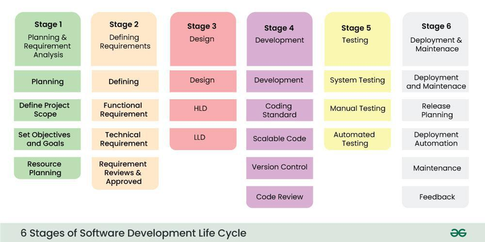

SDLC (Software Development Life Cycle)

software development life cycle, is a methodology that defines the entire procedure of software development step-by-step. The goal of the SDLC life cycle model is to deliver high-quality, maintainable software that meets the user’s requirements

Stages of the Software Development Life Cycle

Software Development Life Cycle Models

**1\. Waterfall Model**

In the waterfall model, once a phase seems to be completed, it cannot be changed

**2\. Agile Model**

The agile model refers to a group of development processes. These processes have some similar characteristics but also possess certain subtle differences among themselves.

**3\. Iterative Model**

each cycle results in a semi-developed but deployable version; with each cycle, some requirements are added to the software, and the final cycle results in the software with the complete requirement specification.

**4\. Spiral Model**

DevOps (Development + Operations)
