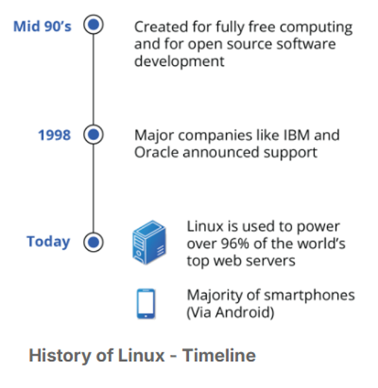

# **Linux**

- Linux is an open-source computer operating system, initially developed for Intel x86-based personal computers. Today it runs on computers, servers, and mobile phones

- Linus Torvalds in 1991 created Linux Kernel

- In 1992, Linux was re-licensed using the General Public License (GPL) by GNU (a project of the Free Software Foundation)

### **Linux Distribution**

- By combining the Linux kernel with other system components from the GNU project, developers created complete systems called Linux Distributions

- In 1998, major companies like IBM and Oracle announced their support for the Linux platform

- Linux borrows heavily from the well-established family of UNIX operating systems.

- Files are stored in a hierarchical filesystem, with the top node of the system being the root or simply "/".

- Linux makes its components available via files or objects that look like files. (Processes, devices, and network sockets are all represented by file.

- Linux is a fully multi-tasking (i.e., multiple threads of execution are performed simultaneously), multiuser operating system with built-in networking and service processes known as daemons
