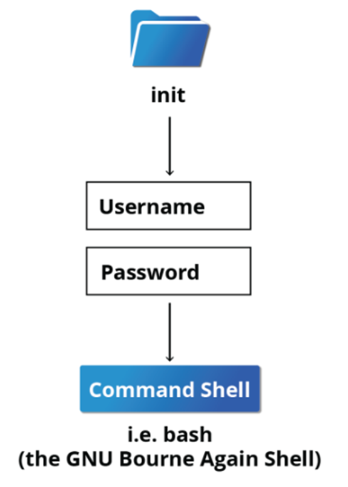

# **The Boot Process**

It consists of everything that happens from when the computer power is first switched on until the user interface is fully operational.

### **STEP 1 : BIOS ( x86-based)**

- When the computer is powered on, the Basic Input/Output System (BIOS) initializes the hardware, including the screen and keyboard, and tests the main memory. This process is also called POST (Power On Self Test).

- The BIOS software is stored on a read-only memory (ROM) chip on the motherboard. After this, the remaining boot process is controlled by the operating system (OS).

### **STEP 2 : Master Boot Record (MBR), EFI Partition, and Boot Loader**

- Once the POST is completed, system control passes from the BIOS to the **boot loader**.

- The boot loader is responsible for loading the kernel image and the initial RAM disk or filesystem (which contains some critical files and device drivers needed to start the system) into memory.

- The boot loader is usually stored on the system’s storage devices (hard disk or SSD drive), either in the boot sector (for traditional BIOS/MBR systems) or the EFI partition (for more recent (Unified) Extensible Firmware Interface or EFI/UEFI systems).

- Up to this stage, the machine does not access any mass storage media. Then, information on the date, time, and the most important peripherals are loaded from the **CMOS** values (after a technology used for the battery-powered memory store, which allows the system to keep track of the date and time even when it is powered off).

- A number of boot loaders exist for Linux; the most common ones are GRUB (for GRand Unified Boot loader), ISOLINUX (for booting from removable media), and DAS U-Boot (for booting on embedded devices/appliances).

### **STEP 3 : Boot Loader in Action**

- For systems using the BIOS/MBR method, the boot loader resides at the first sector of the hard disk, also known as the Master Boot Record (MBR). The size of the MBR is just 512 bytes

- In this stage, the boot loader examines the partition table and finds a bootable partition. Once it finds a bootable partition, it then searches for the second stage boot loader, for example GRUB, and loads it into RAM (Random Access Memory)

- For systems using the EFI/UEFI method, UEFI firmware reads its Boot Manager data to determine which UEFI application is to be launched and from where (i.e., from which disk and partition the EFI partition can be found). The firmware then launches the UEFI application, for example GRUB, as defined in the boot entry in the firmware's boot manager. This procedure is more complicated but more versatile than the older MBR methods.

- The second stage boot loader resides under /boot. A splash screen is displayed, which allows us to choose which operating system (OS) and/or kernel to boot.

- After the OS and kernel are selected, the boot loader loads the kernel of the operating system into RAM and passes control to it. Kernels are almost always compressed, so the first job they have is to uncompress themself. After this, it will check and analyze the system hardware and initialize any hardware device drivers built into the kernel.

### **STEP 4 : The Initial RAM Disk**

- The **initramfs** filesystem image contains programs and binary files that perform all actions needed to mount the proper root filesystem, including providing the kernel functionality required for the specific filesystem that will be used, and loading the device drivers for mass storage controllers, by taking advantage of the udev system (for user device), which is responsible for figuring out which devices are present, locating the device drivers they need to operate properly, and loading them. After the root filesystem has been found, it is checked for errors and mounted.

- The **mount** program instructs the operating system that a filesystem is ready for use and associates it with a particular point in the overall hierarchy of the filesystem (the **mount point**). If this is successful, the initramfs is cleared from RAM, and the **init** program on the root filesystem **(/sbin/init)** is executed.

- init handles the mounting and pivoting over to the final real root filesystem. If special hardware drivers are needed before the mass storage can be accessed, they must be in the initramfs image.

### **STEP 5 : Text-Mode Login**

- Near the end of the boot process, **init** starts a number of text-mode login prompts. These enable you to type your username, followed by your password, and to eventually get a command shell. However, if you are running a system with a graphical login interface, you will not see these at first.

- the terminals which run the command shells can be accessed using the ALT key plus a function key. Most distributions start six text terminals and one graphics terminal starting with F1 or F2. Within a graphical environment, switching to a text console requires pressing CTRL-ALT + the appropriate function key (with F7 or F1 leading to the GUI).

- Usually, the default command shell is bash (the GNU Bourne Again Shell), but there are a number of other advanced command shells available. The shell prints a text prompt, indicating it is ready to accept commands; after the user types the command and presses Enter, the command is executed, and another prompt is displayed after the command is done.

