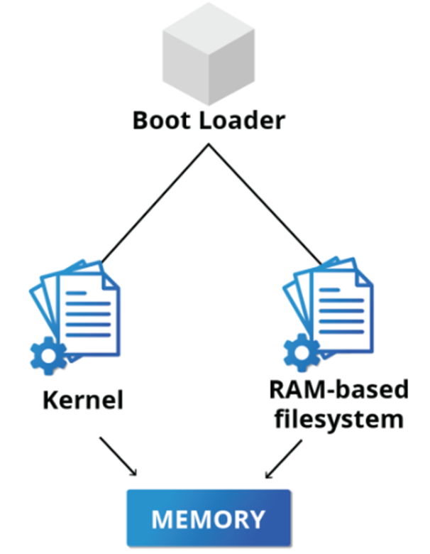
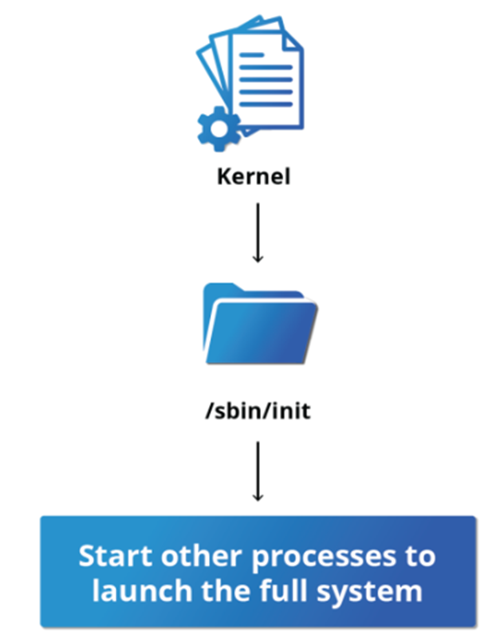

# **Kernel, init and Services**

### The linux Kernel

- The boot loader loads both the kernel and an initial RAM–based file system (initramfs) into memory, so it can be used directly by the kernel.

- When the kernel is loaded in RAM, it immediately initializes and configures the computer’s memory and also configures all the hardware attached to the system. This includes all processors, I/O subsystems, storage devices, etc.

### **/sbin/init and Services**

- Once the kernel has set up all its hardware and mounted the root filesystem, the kernel runs /sbin/init. This then becomes the initial process, which then starts other processes to get the system running.

- init is responsible for keeping the system running and for shutting it down cleanly. It also act, when necessary, as a manager for all non-kernel processes; it cleans up after them upon completion, and restarts user login services as needed when users log in and out, and does the same for other background system services.

### **Startup Alternatives**

- SysVinit viewed things as a serial process, divided into a series of sequential stages. Each stage required completion before the next could proceed. Thus, startup did not easily take advantage of the parallel processing that could be done with the multiple processors or cores found on modern systems.

The two main alternatives developed were:

**Upstart**

- Developed by Ubuntu and first included in 2006
- Adopted in Fedora 9 (in 2008) and in RHEL 6 and its clones

**systemd**

- Adopted by Fedora first (in 2011)
- Adopted by RHEL 7 and SUSE
- Replaced Upstart in Ubuntu 16.04

### **systemd Features**

- Systems with systemd start up faster than those with earlier init methods. This is largely because it replaces a serialized set of steps with aggressive parallelization techniques, which permits multiple services to be initiated simultaneously.

- Complicated startup shell scripts are replaced with simpler configuration files, which enumerate what has to be done before a service is started, how to execute service startup, and what conditions the service should indicate have been accomplished when startup is finished. One thing to note is that /sbin/init now just points to /lib/systemd/systemd; i.e. systemd takes over the init process.
